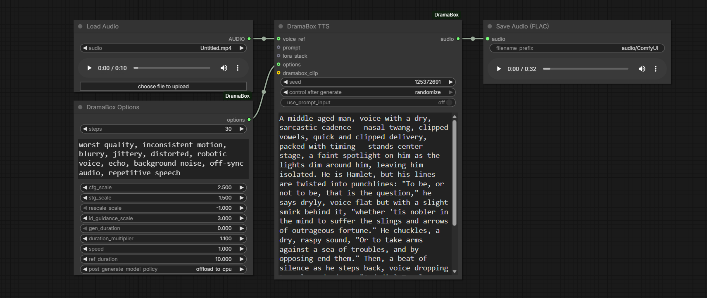

# ComfyUI-DramaBox

ComfyUI custom nodes for [DramaBox](https://github.com/resemble-ai/DramaBox) — ResembleAI's expressive text-to-speech system built on the LTX-2.3 audio diffusion transformer.

## Nodes

| Node | Description |
|------|-------------|
| **DramaBox TTS** | Generates speech audio from a text prompt. Optionally accepts a voice reference clip and advanced options. All model weights are downloaded automatically on first use. |
| **DramaBox CLIP Loader** | Loads a Gemma text encoder from your `text_encoders` folder. (Optional) Connect to the TTS node's `dramabox_clip` input to override the default encoder. |
| **DramaBox Options** | Advanced generation settings (steps, CFG scale, duration, memory policy, etc.). (Optional) Connect to the DramaBox TTS node's `options` input. |

## Text Encoder

DramaBox uses a Gemma 3 12B text encoder. By default the node loads **`gemma_3_12B_it_fp4_mixed.safetensors`** — the same file used by ComfyUI's own LTX-2 workflows, so if you already have it you're good to go. If it is not present it is downloaded automatically into your `ComfyUI/models/text_encoders/` folder on first use.

### Changing the default encoder

**Per-installation preference** — open *ComfyUI Settings → DramaBox → Default Text Encoder filename* and enter the filename of any Gemma safetensors already in your `text_encoders` folder (e.g. `gemma_3_12b_it_fp8_scaled.safetensors`). Leave it blank to keep the fp4 default.

**Memory preference** — open *ComfyUI Settings → DramaBox → Text Encoder → Memory* and keep **Offload text encoder after prompt encoding** enabled (default) to move Gemma back to CPU immediately after text encoding. This lowers VRAM usage for the diffusion stages. If you have plenty of VRAM and prefer maximum throughput, you can disable it.

**Per-workflow override** — add a **DramaBox CLIP Loader** node, select the model you want, and connect its output to the TTS node's `dramabox_clip` input. This takes precedence over the global preference and lets you switch encoders between workflows without touching settings.

### Post-generate memory policy (Options node)

The **DramaBox Options** node includes `post_generate_model_policy` with three modes:

- `keep_loaded` — fastest next run, highest persistent memory usage.
- `offload_to_cpu` — unloads DramaBox models from VRAM after generation but keeps them in CPU RAM for faster reuse.
- `unload` — fully unloads models from both VRAM and RAM; next run reloads from disk.

For most users, `offload_to_cpu` is a good balance between memory savings and iteration speed.

<div align="center">
  
</div>

## LoRA Support

The **DramaBox TTS** node accepts a `lora_stack` input (connect any ComfyUI **LORA_STACK** output). LoRA weights are applied directly into the already-loaded model and removed immediately after generation, so you can switch LoRAs between runs without triggering a slow model reload.

LoRAs and voice reference samples work independently and can be used together. A LoRA bakes a trained voice style into the model weights, while a voice reference sample is fed as audio conditioning during generation. Using both at once — for example a LoRA trained on a voice alongside a reference clip of that same voice — will reinforce the effect.

> **Note:** DramaBox LoRAs are specific to this model and cannot be used with other ComfyUI nodes such as LTX Video.


### Training your own voice LoRAs

Voice LoRAs for DramaBox can be trained with **[Voice Clone Studio — DramaBox Edition](https://github.com/FranckyB/Voice-Clone-Studio-DramaBox)**, a stripped-down version of Voice Clone Studio, made for DramaBox, for both inference and LoRA training. It provides a dataset creator that automatically transcribes and splits your long audio clips into smaller clips ready to be used by the trainer. Drop the resulting `.safetensors` file into ComfyUI's `models/loras/` folder.

## Installation

1. Navigate to your ComfyUI custom nodes directory:
   ```
   cd ComfyUI/custom_nodes/
   ```
2. Clone this repository:
   ```bash
   git clone https://github.com/FranckyB/ComfyUI-DramaBox.git
   ```
3. Activate your ComfyUI virtual environment:
   Windows (cmd):
   ```bat
   ..\ComfyUI\venv\Scripts\activate
   ```
   Linux/macOS (bash/zsh):
   ```bash
   source ../ComfyUI/venv/bin/activate
   ```
4. Enter the repository:
   ```bash
   cd ComfyUI-DramaBox
   ```

5. Install dependencies:
   ```bash
   pip install -r requirements.txt
   ```

6. On first run, the node will automatically download DramaBox model weights into `ComfyUI/models/dramabox/`.

## Changelog

### May 2026
- **Text encoder overhaul** — DramaBox now uses ComfyUI's standard CLIP infrastructure for the Gemma text encoder, matching the native LTX-2 loading path for correct VRAM management.
- **Default encoder** — switched to `gemma_3_12B_it_fp4_mixed.safetensors` (ComfyUI/Comfy-Org's own quantized file, ~8 GB vs ~24 GB for the previous bnb-4bit snapshot). Downloaded automatically into `text_encoders/` on first use if not already present.
- **DramaBox CLIP Loader node** — new optional node to load any Gemma safetensors from `text_encoders/`. Connect to the TTS node's `dramabox_clip` input for per-workflow encoder selection.
- **Settings preference** — added *ComfyUI Settings → DramaBox → Default Text Encoder filename* to set a global default without needing a CLIP Loader node in every workflow.
- **Old Gemma snapshot cleanup** — the large `gemma-3-12b-it-bnb-4bit/` model directory (previously downloaded into `models/dramabox/`) is automatically removed on startup since it is no longer needed.
- **Removed info output** — the `info` string output has been removed from the DramaBox TTS node.

## Credits

- [DramaBox](https://github.com/resemble-ai/DramaBox) by [ResembleAI](https://www.resemble.ai/)
- Built on the [LTX-Video](https://github.com/Lightricks/LTX-Video) audio diffusion architecture by Lightricks
